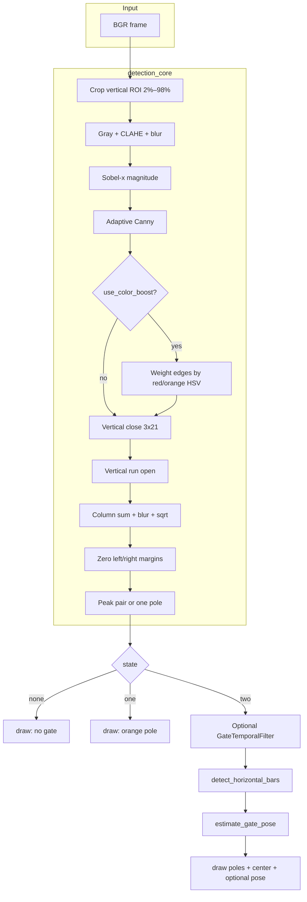

# SAUVC Gate Detection Pipeline

Classical computer-vision pipeline for **navigation** and **qualification** gates in the **Singapore Autonomous Underwater Vehicle Challenge (SAUVC)**. It uses **OpenCV** and **NumPy** only (no neural nets) and is meant to run on embedded hardware such as a **Jetson Orin Nano**.

The detector looks for **two tall vertical structures** (gate poles). It does **not** invent a second pole when only one is visible. When both poles are found, it can optionally estimate a **plane pose** with PnP and report a **yaw-error hint** for lining the vehicle up with the gate.

Default physical model: **1.5 m** between vertical pole centers (`--gate-width`). Gate **height** in 3D is inferred from the image quad aspect unless you pass a fixed height in code.

---

## Table of contents

1. [What this software does](#1-what-this-software-does)
2. [Quick start](#2-quick-start)
3. [Repository layout (every file)](#3-repository-layout-every-file)
4. [Coordinate systems and conventions](#4-coordinate-systems-and-conventions)
5. [End-to-end data flow](#5-end-to-end-data-flow)
6. [Detection states](#6-detection-states)
7. [Detection algorithm (`detection_core.py`) — full detail](#7-detection-algorithm-detection_corepy--full-detail)
8. [Frame pipeline (`pipeline.py`)](#8-frame-pipeline-pipelinepy)
9. [Temporal smoothing (`temporal.py`)](#9-temporal-smoothing-temporalpy)
10. [Pose estimation (`pose_pnp.py`) — full detail](#10-pose-estimation-pose_pnppy--full-detail)
11. [Overlays (`draw.py`)](#11-overlays-drawpy)
12. [Public package API (`__init__.py`)](#12-public-package-api-__init__py)
13. [Command-line tools](#13-command-line-tools)
14. [Configuration (`PipelineConfig`)](#14-configuration-pipelineconfig)
15. [Datasets, `.gitignore`, and packaging](#15-datasets-gitignore-and-packaging)
16. [Integrating on the vehicle](#16-integrating-on-the-vehicle)
17. [Tuning and troubleshooting](#17-tuning-and-troubleshooting)
18. [Dependencies](#18-dependencies)
19. [Authors](#19-authors)

---

## 1. What this software does

For every BGR image (still or camera frame) the pipeline produces:

| Output | Type | Meaning |
|--------|------|---------|
| **`state`** | `"none"` / `"one"` / `"two"` | How many vertical poles it trusts |
| **`left_x`, `right_x`** | float pixels | Sub-pixel column of left/right poles when `state == "two"` |
| **`center_x`, `center_y`** | float pixels | Gate center (mid-x of poles; y from vertical support in the edge mask) |
| **`distance_px`** | float | Apparent width `right_x - left_x` |
| **`center_err`** | float (computed in pipeline) | `0.5*(left+right) - image_width/2` — positive means gate is right of image center |
| **`skew_score`** | float ≈ \([-1, 1]\) | Imbalance of vertical edge mass left vs right pole |
| **`filtered_edges`** | `uint8` mask | Long vertical edge support (debug + PnP line fitting) |
| **`column_strength`** | 1-D float | Per-column histogram used to pick poles |
| **Pose (optional)** | `GatePoseResult` | Rotation/translation, plane normal in camera frame, yaw hint, reprojection error |

**Navigation vs qualification**

- **Navigation** (`use_color_boost=False`): structure only — Sobel-x, Canny, morphology, column histogram. Use this when poles are not reliably red/orange or color is washed out underwater.
- **Qualification** (`use_color_boost=True`): same structure path, but Canny edges in red/orange HSV regions are **boosted** so colored poles stand out against murk.

Both tasks share the same geometry logic. Color is an optional weight, not a separate detector.

---

## 2. Quick start

**Environment (Python 3.8+)**

```bash
cd /path/to/Gate-Detection
python3 -m venv .venv
source .venv/bin/activate
pip install -r requirements.txt
```

Optional editable install (so `import gate_detection` works from anywhere):

```bash
pip install -e .
```

Without that install, the scripts add the **repository root** to `sys.path` automatically.

**Images:** put `.png` frames in a folder. Relative `--folder` paths are resolved from the **repo root**, not from `scripts/`. See [Datasets](#15-datasets-gitignore-and-packaging).

```bash
# Navigation-style (no HSV boost)
python3 scripts/navigation_gate_detector.py --folder images/image_navigation_01

# Qualification-style (HSV red/orange boost)
python3 scripts/qualification_gate_detector.py --folder images/image_qualification_01

# Live camera
python3 scripts/live_gate_detector.py --device 0 --fov 65 --temporal 0.4

# Metrics, no GUI
python3 scripts/evaluate_gates.py --folder images/image_navigation_01
```

OpenCV windows: **Esc** stops batch viewers; **q** or **Esc** stops live mode.

---

## 3. Repository layout (every file)

```
Gate-Detection/
├── README.md                          # this document
├── requirements.txt                   # pinned pip dependencies
├── pyproject.toml                     # package metadata for pip install -e .
├── .gitignore                         # datasets, venvs, caches, videos
├── data/
│   └── README.md                      # where to put local images/videos
├── gate_detection/                    # importable library
│   ├── __init__.py
│   ├── detection_core.py
│   ├── pipeline.py
│   ├── pose_pnp.py
│   ├── draw.py
│   └── temporal.py
└── scripts/                           # CLI entry points
    ├── __init__.py
    ├── _repo.py
    ├── batch_viewer.py
    ├── navigation_gate_detector.py
    ├── qualification_gate_detector.py
    ├── live_gate_detector.py
    └── evaluate_gates.py
```

### Root files

| File | Purpose |
|------|---------|
| **`README.md`** | Project documentation (this file). |
| **`requirements.txt`** | `opencv-python==4.8.1.78` and `numpy==1.24.4`. Use this for a frozen environment that matches development. |
| **`pyproject.toml`** | Declares package name `gate-detection`, Python `>=3.8`, the same dependencies, and tells setuptools to include the `gate_detection` package. Enables `pip install -e .`. |
| **`.gitignore`** | Excludes local datasets (`images/`, `air_dataset/`, `gopro_videos/`), video extensions, virtualenvs (`.venv/`, `venv/`, `env/`, `gate_env/`), `__pycache__`, `*.pyc`, packaging artifacts (`*.egg-info/`, `build/`, `dist/`), IDE folders, and OS junk. |

### `data/README.md`

Not a dataset. It documents **where humans should put data** that must stay untracked: `images/` for PNG sequences, optional `air_dataset/`, `gopro_videos/` for source clips. It reminds you that `--folder` is relative to the repo root.

### `gate_detection/` — library

| File | Role |
|------|------|
| **`__init__.py`** | Re-exports the public API (`process_frame`, `PipelineConfig`, detectors, pose helpers, `GateTemporalFilter`). |
| **`detection_core.py`** | All 2D pole finding: CLAHE, Sobel-x, Canny, morphology, column histogram, peak pairing, `none`/`one`/`two`. |
| **`pipeline.py`** | One-frame orchestration: detect → optional EMA → horizontal-bar overlay → PnP → draw. Defines `PipelineConfig`. |
| **`pose_pnp.py`** | Camera matrix from FOV, 4-corner construction, `solvePnP` / RANSAC / LM refine, plane normal, yaw, reprojection error. |
| **`draw.py`** | In-place OpenCV overlays and the column-strength debug strip used by evaluation. |
| **`temporal.py`** | Exponential moving average on left/right pole x, with jump-reset. |

### `scripts/` — tools

| File | Role |
|------|------|
| **`__init__.py`** | Empty. Makes `scripts` a package so `from scripts.batch_viewer import ...` works after the repo root is on `sys.path`. |
| **`_repo.py`** | `REPO_ROOT = Path(__file__).resolve().parents[1]` and `ensure_repo_on_path()` so CLIs can import `gate_detection` without install. |
| **`batch_viewer.py`** | Shared loop: list `.png`, `process_frame`, two windows, print counts. Used by navigation and qualification CLIs. |
| **`navigation_gate_detector.py`** | Thin CLI: `use_color_boost=False`, default folder `images/image_navigation_01`. |
| **`qualification_gate_detector.py`** | Same CLI flags with `use_color_boost=True` and extra “two-pole rate” in the summary. |
| **`live_gate_detector.py`** | V4L2/webcam loop, FPS overlay, live-oriented defaults (`--temporal 0.4`). |
| **`evaluate_gates.py`** | Batch statistics (states, PnP reproj, \|yaw\|). Optional `--viz` with three debug windows. |

---

## 4. Coordinate systems and conventions

**Image (OpenCV)**

- Origin at the **top-left**.
- **x** increases to the right (column).
- **y** increases **down** (row).
- Color is **BGR**.

**Camera (pinhole, for PnP)**

- **+Z** forward (out of the camera, toward the scene).
- **+X** to the right in the image.
- **+Y** down in the image (OpenCV convention).

**Gate object frame (PnP model)**

- Rectangle in plane **Z = 0**.
- Origin at the **bottom-left** corner of the rectangle.
- **+X** along width (meters, left pole → right pole).
- **+Y** along height (meters, “up” in the object). Because image y is down, object Y still corresponds to the vertical extent of the quad after corner ordering.

**Corner order for PnP** (after `order_image_corners_quad`): **BL, BR, TR, TL** in image coordinates.

**Yaw hint**

- Plane normal `n_cam` is the object +Z rotated into the camera.
- Direction **into** the gate is **`-n_cam`**.
- `yaw_error_deg = atan2(nx, nz)` on that “into” vector (level-camera approximation; pitch `ny` is ignored). Positive values are intended as “turn right to square up.” Treat as a **hint**, not a calibrated heading until `K` and distortion are real.

---

## 5. End-to-end data flow



`process_frame()` always returns a **copy** of the frame with overlays. The original array is not modified.

---

## 6. Detection states

The pipeline **refuses** to fabricate a second pole.

| State | When | Downstream |
|-------|------|------------|
| **`none`** | No usable column energy, or an ambiguous second peak that failed pairing (see below). Overlay: “no gate”. | No PnP, no center line. |
| **`one`** | One dominant vertical peak; no second peak in the allowed separation band at ≥ 18% of the strongest peak. Overlay: orange pole + “2nd pole…”. | Treat as approach / occlusion / side-on view. Do **not** steer as if a gate center exists. |
| **`two`** | A left/right pair passed spacing and strength checks. | Temporal EMA (optional), bar overlay, PnP, full geometry overlay. |

**Ambiguous partner → `none`:** if pairing failed but a second peak sits in `[min_sep, max_sep]` with strength ≥ `0.18 * strongest`, the code returns **`none`** rather than **`one`**. That avoids drawing a single pole when the histogram looks like a broken two-pole gate.

---

## 7. Detection algorithm (`detection_core.py`) — full detail

This file is the entire 2D detector. Everything else consumes `GateStateResult`.

### 7.1 Data classes

**`GateState`** — `Literal["none", "one", "two"]`.

**`GateDetectionResult`** — older / simpler wrapper used by `detect_gate()`:

- `ok`: True only if two poles.
- `left_x`, `right_x`, `center_x`, `center_y`, `distance_px`.
- `filtered_edges`: same mask as the stateful API.

**`GateStateResult`** — what the pipeline uses:

| Field | Meaning |
|-------|---------|
| `state` | `none` / `one` / `two` |
| `left_x`, `right_x` | Pole x (meaningful for `two`) |
| `center_x`, `center_y` | For `two`: mid-x and support mid-y. For `one`: the single pole x and its y. For `none`: image center. |
| `distance_px` | Width in pixels (`two` only) |
| `single_x`, `single_strength` | Dominant pole for `one` |
| `skew_score` | Left vs right edge-mass imbalance (`two`) |
| `roi_y0` | Row offset of the processed ROI in the full frame (needed to map PnP y back) |
| `column_strength` | 1-D histogram (`repr=False` so prints stay short) |
| `filtered_edges` | Binary vertical-support mask, **ROI height × full width** |

### 7.2 Helpers

**`_local_maxima_1d(s, min_dist)`**

- Strict local maxima: `s[i] >= s[i-1]` and `s[i] >= s[i+1]`.
- Skips plateaus that equal the left neighbor (avoids duplicate peaks on flats).
- Sorts candidates by height, greedily keeps peaks at least `min_dist` apart, caps at **24** peaks.

**`_parabolic_peak_x(s, ix)`**

Sub-pixel peak: fit a parabola through `s[ix-1], s[ix], s[ix+1]`:

\[
dx = \frac{1}{2}\frac{y_{0}-y_{2}}{y_{0}-2y_{1}+y_{2}}
\]

`dx` is clipped to \([-0.5, 0.5]\). If the denominator is ~0, returns integer `ix`.

**`_vertical_run_filter(edges, min_run)`**

Morphological **opening** with a `1 × min_run` rectangle. Short speckles and horizontal junk disappear; only **tall** vertical strokes survive. `min_run` is at least 3.

**`_gate_center_y_from_runs(filtered, left_i, right_i, half_w=6)`**

For each pole column, look in `x ± 6`, find rows with any on-pixel, take mid of min/max y, average left and right. If empty, use half the ROI height. Result is in **ROI coordinates**; callers add `roi_y0`.

**`_red_boost_mask_bgr(bgr)`** (qualification)

HSV in-range:

- Hue **0–12** (red–orange), S ≥ 60, V ≥ 50
- Hue **165–180** (wrap-around red), same S/V

OR the two masks, close with a 5×5 ellipse, return float weights in `[0, 1]`.

### 7.3 `build_column_strength` — turning an image into a 1-D pole histogram

**ROI.** Rows from `2%` to `98%` of height (`roi_top_frac=0.02`, `roi_bot_frac=0.98`). Drops a thin strip of surface glare / floor. Full width is kept.

**Contrast.** BGR → gray → **CLAHE** (`clipLimit=3.0`, tiles `8×8`). Local contrast stretch for murky, uneven lighting.

**Blur.** Gaussian `3×3` to reduce speckle before derivatives.

**Vertical edges.** Sobel **x** (kernel 3), absolute value, `uint8`. Poles are vertical, so horizontal intensity change is the cue.

**Adaptive Canny** on the Sobel magnitude (not on gray):

- Median of **nonzero** Sobel pixels (`med`), default 25 if empty.
- `low = max(12, 0.5 * med)`, `high = max(28, 1.2 * med)`.

This tracks scene contrast instead of fixed thresholds.

**Optional color boost.** If `use_color_boost`:

`edges = clip(edges * (0.2 + 0.8 * red_mask), 0, 255)`

Non-red edges keep 20% weight; red/orange edges keep up to 100%. Structure is never fully discarded.

**Connect broken poles.** Morphological **close** with `3×21` rectangle (narrow, tall). Gaps along a pole are filled.

**Drop short segments.** `min_run = max(45, 0.20 * ROI_height)` then `_vertical_run_filter`. A pole must occupy a large fraction of the vertical ROI.

**Histogram.** Sum the binary mask **down each column** → `col`. Smooth with a 1-D Gaussian whose kernel width is `min(71, max(5, width//12) | 1)` (odd). Then **`sqrt(col + 1e-6)`** to compress huge peaks so a second pole can still compete.

**Border ignore.** `margin = max(3, width * edge_ignore_frac)` (default **4%**). Zero `col[:margin]` and `col[-margin:]`. Webcam bezels, letterboxing, and vignetting often look like strong verticals at the sides.

**Returns:** `(column_strength, filtered_uint8, (0, y0, width, y1))`.

### 7.4 `pick_pole_pair` — choosing two columns

Inputs: histogram `s`, image `width`, `min_sep_px`, `max_sep_px` (default `0.82 * width` if omitted), `strength_floor_ratio` (pipeline uses **0.12** via `detect_gate_with_state`).

1. If `max(s) <= 0`, fail.
2. Floor = `ratio * max(s)`. Peaks below the floor are ignored.
3. Local maxima with `min_dist = max(8, min_sep // 8)`.
4. If fewer than two peaks, **relax**: floor `0.08 * max`, `min_dist = 6`.
5. Score every pair with separation in `[min_sep, max_sep]`:

   `score = s[a] * s[b] * (1 + 2e-4 * sep)`

   Product favors two strong poles; the small `sep` term slightly prefers a wider pair among similar strengths (typical gate vs two nearby texture peaks).
6. If still no pair, brute-force the **top 24** histogram bins (not only maxima) with score `s[a]*s[b]`.
7. Sub-pixel refine both indices with `_parabolic_peak_x`.

Returns `(left_idx, right_idx, left_x_sub, right_x_sub)` or `None`.

### 7.5 `pole_skew_metric`

Sum of `filtered` in bands `x ± 7` around each integer pole. Returns `(sl - sr) / (sl + sr)`. Positive → more vertical support on the **left**. Useful as a quality / occlusion cue, not a heading.

### 7.6 `detect_gate_with_state` — the public detector

Parameters:

- `use_color_boost` (default False)
- `min_sep_frac = 0.11` → min pole spacing **11% of image width** (at least 20 px)
- `max_sep_frac = 0.78` → max spacing **78% of width**
- `edge_ignore_frac = 0.04`

Steps:

1. Build histogram + mask.
2. If histogram is all zeros → **`none`**.
3. `pick_pole_pair` with `strength_floor_ratio=0.12`.
4. If a pair exists: order left/right, compute `center_y` from runs, `skew_score`, return **`two`**.
5. Else find local maxima ≥ `0.10 * smax`.
   - No peaks → **`none`**.
   - Strongest peak has a partner in the sep band with ≥ `0.18 * col[best]` → **`none`** (ambiguous).
   - Otherwise **`one`** at the sub-pixel strongest peak.

### 7.7 `detect_gate`

Compatibility wrapper: calls `detect_gate_with_state`, maps `two` → `GateDetectionResult(ok=True, ...)`, otherwise `ok=False` with image-center placeholders.

---

## 8. Frame pipeline (`pipeline.py`)

This is the function vehicle code should call: **`process_frame(frame_bgr, cfg, temporal)`**.

### 8.1 `PipelineConfig`

See [section 14](#14-configuration-pipelineconfig).

### 8.2 `detect_horizontal_bars(frame, left, right)`

**Overlay only** (not used by PnP). Between the two pole x-columns:

1. Gray, Gaussian 5×5, Sobel-**y**, Canny 30/80.
2. Close with `25×3` (wide, short) to link horizontal bars.
3. Row-sum, Gaussian 51×1, take strongest row, then a second peak at least **40 px** away.

Returns up to two y-coordinates drawn as orange segments. Helps humans see top/bottom members; PnP uses a different, slant-aware bar fitter in `pose_pnp.py`.

### 8.3 `process_frame`

1. Copy the frame.
2. `detect_gate_with_state(..., use_color_boost, edge_ignore_frac)`.
3. **`none`**: `draw_status_corner("no gate")`, return `(st, None, out)`.
4. **`one`**: `draw_one_pole_searching`, return `(st, None, out)`.
5. **`two`**:
   - If `temporal` is not None and `temporal_alpha > 0`, replace pole x with EMA (`update_two(..., frame_width=w)`).
   - `center_err = 0.5*(lx+rx) - w/2`.
   - Horizontal bars between rounded pole columns.
   - If `use_pnp` and a mask exists: `K = camera_matrix_from_fov(w, h, fov)`, then `estimate_gate_pose(..., height_m=None)` so height is inferred from the quad.
   - **Draw gate:** PnP arrow/corners/text only if `pose.ok` and **`reproj_err_px <= 25`**. The returned `pose` object is still the raw solve (even if overlay is hidden).
6. Return `(state_result, pose_or_none, display_bgr)`.

The 25 px overlay gate is conservative: a numerically “successful” PnP with huge reprojection is treated as unreliable for the HUD.

---

## 9. Temporal smoothing (`temporal.py`)

**`SmoothedPoles`**: dataclass holding `left_x`, `right_x` (not heavily used; the filter stores internals).

**`GateTemporalFilter(alpha=0.45, max_jump_frac=0.32)`**

EMA when both poles exist:

\[
x \leftarrow \alpha\, x_{\text{prev}} + (1-\alpha)\, x_{\text{meas}}
\]

- **`alpha → 1`**: heavy memory, smoother, slower to track real motion.
- **`alpha → 0`**: follows measurements.
- First update: initialize to the measurement (no lag on the first two-pole frame).

**Jump reset:** if `max_jump_frac > 0` and `frame_width` is given, and either pole jumps more than `max_jump_frac * width` from the smoothed state, **replace** the state with the new measurement (do not EMA). That stops the filter from dragging a real gate toward a previous border artefact.

`reset()` clears state (batch viewer calls this at the end).

Live default alpha is **0.4**. Batch CLIs default **0** (off) because shuffled stills are not a time sequence unless you pass `--temporal ~0.35` on ordered video frames.

---

## 10. Pose estimation (`pose_pnp.py`) — full detail

PnP runs **only** after two poles are known. It estimates how the gate **plane** sits in the camera.

### 10.1 Constants

- `GATE_WIDTH_M = 1.5`
- `GATE_HEIGHT_M = 1.5` — fallback if aspect inference fails; default path infers height.

### 10.2 `camera_matrix_from_fov(width, height, horizontal_fov_deg=60)`

Pinhole, square pixels, principal point at the image center:

\[
f_x = \frac{W/2}{\tan(\text{FOV}/2)},\quad f_y = f_x
\]

\[
K = \begin{bmatrix} f_x & 0 & W/2 \\ 0 & f_y & H/2 \\ 0 & 0 & 1 \end{bmatrix}
\]

**Wrong FOV ⇒ wrong K ⇒ wrong yaw/normal even if poles look perfect.** For the vehicle, replace this with in-water calibration. Distortion `D` is currently passed as **zeros** from the pipeline.

### 10.3 `object_points_rectangle(width_m, height_m)`

Four 3D points: BL `(0,0,0)`, BR `(W,0,0)`, TR `(W,H,0)`, TL `(0,H,0)`.

### 10.4 `infer_gate_height_m(corners, width_m)`

Let `pw = ||BR−BL||`, `ph = ||TL−BL||` in **pixels**. Then `height_m = width_m * ph / pw`. The 3D rectangle matches the **observed aspect** instead of forcing a 1.5×1.5 m square. If `pw` is tiny, fall back to `GATE_HEIGHT_M`.

### 10.5 `order_image_corners_quad`

Sort by y: two highest (top), two lowest (bottom). Sort each pair by x → TL, TR and BL, BR. Return `[BL, BR, TR, TL]`.

### 10.6 Line fitting

**`_fit_line_from_mask_points`:** `cv2.fitLine` (L2) on mask pixels in a vertical band around a pole. Needs **≥ 30** points. Returns a point and a direction.

**`_intersect_lines`:** parametric intersection of two 2D lines. Parallel (`|det| < 1e-8`) → `None`.

**`_horizontal_line_from_edges`:** top or bottom member **between poles**:

1. Band from `min(x_left,x_right)-5` to `max+5`.
2. Blur, Sobel-y, Canny 25/70, close 7×7 ellipse.
3. Upper or lower half of the ROI (with padding ~`h/10`, clamped).
4. If ≥ 28 edge pixels: `fitLine` (allows **slanted** bars).
5. Else: row-sum of the edge map; pick a peak in the upper or lower half; synthesize a **horizontal** line at that y (legacy). If row energy `< 50`, fail.

### 10.7 `GatePoseResult`

| Field | Meaning |
|-------|---------|
| `ok` | PnP produced rvec/tvec |
| `rvec`, `tvec` | OpenCV pose |
| `normal_cam` | Unit object +Z in camera frame (gate plane normal; “from gate toward camera” after rotation) |
| `yaw_error_deg` | See §4 |
| `reproj_err_px` | Mean Euclidean error of the four corners after `projectPoints` |
| `image_points` | `4×1×2` image points used in PnP |
| `corners_2d` | List of four `(x,y)` used (full-frame coords) |

### 10.8 `estimate_gate_pose`

Arguments: full BGR frame, `left_x`/`right_x`, `filtered_roi` (same mask as detection), `roi_y0`, `K`, optional `dist`, `width_m`, optional `height_m`.

1. If poles closer than 10 px → fail.
2. `dist` default five zeros.
3. Fit **left and right pole lines** on the mask in `x ± 10` bands, full ROI height.
4. Fit **top and bottom** lines on grayscale ROI with `_horizontal_line_from_edges`.
5. If all four lines exist: intersect BL, BR, TR, TL; add `roi_y0` to y.
6. **Fallback quad:** min/max y of mask support near each pole; axis-aligned rectangle at integer pole x. If no support at all → fail.
7. Order corners; infer height if `height_m is None`.
8. **`solvePnPRansac`**: 200 iterations, reproj threshold 8 px, confidence 0.995, `SOLVEPNP_ITERATIVE`.
9. If that fails: plain **`solvePnP`**.
10. **`solvePnPRefineLM`** (ignore OpenCV errors).
11. `R = Rodrigues(rvec)`; `n_cam = normalize(R @ [0,0,1])`.
12. Reproject object points; mean pixel error.
13. `into = -n_cam`; `yaw = atan2(into_x, into_z)` in degrees.

The pipeline still **returns** this pose when `ok` is True even if reprojection > 25 px; it only **hides** the HUD.

---

## 11. Overlays (`draw.py`)

All drawing is **in-place** on the BGR copy from `process_frame`.

**`draw_status_corner(frame, text, color)`** — small label at `(8, 18)`. Used for “no gate” (pinkish) and “2nd pole…”.

**`draw_two_poles_and_center`**

- Green verticals (thickness 5) at left/right poles, full image height.
- Yellow center line (thickness 3) at `center_x`.
- Gray tick at image center (`w//2`), mid-height.
- Yellow circle at `(center_x, center_y)`.
- Optional orange horizontal segments at `bars_y`.
- Text: `W=…px  err_x=…  skew=…`
- If pose is drawn: second line with `yaw_err`, `reproj`, `n=(nx,ny,nz)`; orange arrow from gate center in the direction of `(n_x, -n_y)` in image (y flipped because image y is down); magenta circles on the four PnP corners.

**`draw_one_pole_searching`** — orange pole (thickness 3) + “2nd pole…”.

**`render_column_strength_bar`** — debug image for `evaluate_gates.py --viz`:

- Plots normalized `column_strength` as a cyan polyline.
- Dark red shading on the left/right **ignored** fractions (`margin_frac`, default 0.04).
- Width clamped to 400–1200 px.

---

## 12. Public package API (`__init__.py`)

Import from the package:

```python
from gate_detection import (
    PipelineConfig,
    process_frame,
    detect_gate_with_state,
    detect_gate,
    GateStateResult,
    GateDetectionResult,
    GatePoseResult,
    GateTemporalFilter,
    camera_matrix_from_fov,
    estimate_gate_pose,
)
```

Typical vehicle loop:

```python
from gate_detection import PipelineConfig, process_frame, GateTemporalFilter

cfg = PipelineConfig(
    use_color_boost=False,
    horizontal_fov_deg=65.0,
    gate_width_m=1.5,
    use_pnp=True,
    temporal_alpha=0.4,
)
filt = GateTemporalFilter(cfg.temporal_alpha, cfg.temporal_max_jump_frac)

st, pose, vis = process_frame(frame_bgr, cfg, filt)
if st.state == "two":
    # use st.left_x, st.right_x, center error, and pose.yaw_error_deg if pose and pose.ok
    pass
```

---

## 13. Command-line tools

Scripts prepend the repo root to `sys.path`. You can run them as `python3 scripts/...` from anywhere if the path is valid; relative image folders still resolve via `REPO_ROOT`.

### 13.1 `scripts/_repo.py`

- `REPO_ROOT`: parent of `scripts/`.
- `ensure_repo_on_path()`: insert that path at `sys.path[0]` if missing.

### 13.2 `scripts/batch_viewer.py`

**`resolve_folder(folder)`** — absolute paths unchanged; relative paths = `REPO_ROOT / folder`.

**`run_batch(folder, cfg, delay_ms, no_gui, extra_summary=False)`**

- Exit 1 if folder missing.
- Builds `GateTemporalFilter` only if `cfg.temporal_alpha > 0`.
- Enumerates **sorted** names ending in **`.png` only** (`.jpg` is ignored).
- GUI: windows `"Gate Detection"` and `"Edges"` (resized mask 640×360). **Esc** (`waitKey == 27`) breaks the loop.
- Counts `two` / `one` / `none`; among `two`, counts raw `pose.ok`.
- Prints a summary. Qualification sets `extra_summary=True` for two-pole **rate %**.
- Resets the temporal filter at the end.

**`add_common_args(parser, default_folder)`** — shared flags for the two batch CLIs:

| Flag | Default | Meaning |
|------|---------|---------|
| `--folder` | task-specific | PNG directory |
| `--delay` | 500 | ms between frames in GUI |
| `--no-gui` | off | Process all, print only |
| `--fov` | 60 | Horizontal FOV (deg) for K |
| `--gate-width` | 1.5 | Pole spacing (m) |
| `--no-pnp` | off | Skip pose |
| `--temporal` | 0 | EMA alpha; 0 = off |

### 13.3 `scripts/navigation_gate_detector.py`

`PipelineConfig(use_color_boost=False, ...)`. Default folder `images/image_navigation_01`.

### 13.4 `scripts/qualification_gate_detector.py`

`use_color_boost=True`. Default `images/image_qualification_01`. Extra two-pole rate in the summary.

### 13.5 `scripts/live_gate_detector.py`

| Flag | Default | Meaning |
|------|---------|---------|
| `--device` | 0 | `VideoCapture` index |
| `--width`, `--height` | 0 | Request size; 0 = driver default |
| `--fov` | 60 | FOV for K |
| `--gate-width` | 1.5 | Gate width (m) |
| `--no-pnp` | off | Disable PnP |
| `--temporal` | **0.4** | EMA on |
| `--qualification` | off | HSV boost |
| `--edge-ignore` | 0.04 | Border fraction in histogram |
| `--temporal-jump` | 0.32 | EMA reset jump (fraction of width) |
| `--show-edges` | off | Second window with the vertical-edge mask |

Capture: try **`CAP_V4L2`**, then default backend. Sets FOURCC **MJPG** when the driver allows. Window `"Gate Live"`; bottom text `FPS ~…  state=…`. Quit with **q** or **Esc**. Always `cap.release()` / `destroyAllWindows()` in `finally`.

### 13.6 `scripts/evaluate_gates.py`

No temporal filter (`process_frame(..., None)`).

| Flag | Default | Meaning |
|------|---------|---------|
| `--folder` | **required** | PNG directory |
| `--qualification` | off | Color boost |
| `--fov` | 60 | FOV |
| `--gate-width` | 1.5 | Width (m) |
| `--edge-ignore` | 0.04 | Histogram margins |
| `--viz` | off | Three windows: overlay, edges, column-strength bar |
| `--delay` | 400 | ms in viz mode |
| `--no-pnp` | off | Faster viz |

Prints image count and state counts. For successful PnP on two-pole frames: mean/median/max **reproj**. Count of frames with **reproj ≤ 25**. Mean **\|yaw_err\|** on that good subset. Then short tuning hints.

---

## 14. Configuration (`PipelineConfig`)

Defined in `gate_detection/pipeline.py`.

| Field | Default | Effect |
|-------|---------|--------|
| `use_color_boost` | `False` | Qualification HSV weighting in Canny |
| `horizontal_fov_deg` | `60.0` | Builds approximate `K` |
| `gate_width_m` | `1.5` | PnP object width |
| `use_pnp` | `True` | Call `estimate_gate_pose` on two-pole frames |
| `temporal_alpha` | `0.0` | EMA alpha; must also pass a `GateTemporalFilter` instance |
| `edge_ignore_frac` | `0.04` | Zero histogram on left/right |
| `temporal_max_jump_frac` | `0.32` | Passed into `GateTemporalFilter` by CLIs |

Detection internals (`min_sep_frac`, CLAHE clip, Canny multipliers, etc.) are **function defaults in `detection_core.py`**, not `PipelineConfig`. Change them in code (or extend the config) if a pool/camera needs it.

---

## 15. Datasets, `.gitignore`, and packaging

Large media is **not** in git.

| Ignored path | Typical use |
|--------------|-------------|
| `images/` | PNG sequences, e.g. `images/image_navigation_01/` |
| `air_dataset/` | Extra stills |
| `gopro_videos/` | Source video |
| `*.mp4`, `*.mov`, `*.avi` | Any leftover clips |

Batch tools only list **`.png`**. Convert other formats first.

`data/README.md` repeats this for people who never open `.gitignore`.

**`pyproject.toml`:** `pip install -e .` installs `gate-detection` with the pinned OpenCV/NumPy versions. `[tool.setuptools.packages.find]` includes `gate_detection*`.

---

## 16. Integrating on the vehicle

1. Capture BGR frames from the camera node (or wrap the live-script loop).
2. Call **`process_frame`** every frame with a persistent `GateTemporalFilter` if you want EMA.
3. **Control:** use `state == "two"` for centering and PnP. Treat `one` as degraded (do not invent a center). Treat `none` as lost.
4. **Lateral error:** `0.5 * (left_x + right_x) - width/2` (pixels). Convert to angle with FOV if needed: roughly `atan((err_x / (W/2)) * tan(FOV/2))`.
5. **Yaw:** `pose.yaw_error_deg` only when `pose.ok` and preferably `reproj_err_px <= 25`. Fuse with IMU; this yaw assumes a level camera and approximate `K`.
6. **Calibration:** replace `camera_matrix_from_fov` with in-water `K` and pass real `dist` into `estimate_gate_pose` (requires a small pipeline change; `estimate_gate_pose` already accepts `dist`).
7. **ROS 2:** subscribe to images, publish debug `vis` and a status message (`state`, pole x, yaw, reproj). This repo does not include a node yet.

---

## 17. Tuning and troubleshooting

| Symptom | What to try |
|---------|-------------|
| Poles look good, yaw/PnP garbage | `--fov` does not match the lens; calibrate `K`/`D` underwater. |
| False poles on the left/right of a webcam | Increase `--edge-ignore` (e.g. 0.05–0.08). |
| Jittery live overlay | Raise `--temporal` toward 0.5; if it sticks to old poles, lower `--temporal-jump`. |
| Too many `one` / `none` | Inspect **Edges**. Poles too short → `min_run` / ROI. Too close/far in the image → `min_sep_frac` / `max_sep_frac` in `detect_gate_with_state`. |
| Qualification poles invisible | Confirm they are actually red/orange in HSV; if not, use navigation mode (no boost). If they are red but weak, boost is already on — check lighting and CLAHE. |
| High `one` with two visible poles | Pair scoring failed; relax `strength_floor_ratio` or sep fractions. Ambiguous partner path may be forcing `none`. |
| PnP `ok` but overlay missing | Reproj > 25 px; corners likely bad (blur, missing top bar). Check magenta corners in viz when reproj is low enough to draw. |
| Batch finds 0 images | Files are not `.png`, or `--folder` is relative to the wrong place (it is repo root). |
| NumPy / OpenCV import error | Use the pinned versions in `requirements.txt` (OpenCV 4.8.x expects NumPy 1.x). |

**Parameters worth knowing (in code):**

| Location | Parameter | Role |
|----------|-----------|------|
| `build_column_strength` | CLAHE clip 3.0 | Local contrast |
| | Canny `0.5/1.2 * median` | Edge sensitivity |
| | close `3×21` | Join broken verticals |
| | `min_run = max(45, 0.2*H)` | Minimum pole height |
| | `edge_ignore_frac` | Side bands |
| `detect_gate_with_state` | `min_sep_frac=0.11` | Poles not too close |
| | `max_sep_frac=0.78` | Poles not spanning almost the whole frame |
| `pick_pole_pair` | floor 0.12 / relax 0.08 | Peak strength |
| `process_frame` | reproj ≤ 25 | HUD quality gate |
| `GateTemporalFilter` | `alpha`, `max_jump_frac` | Live smoothness vs lock-on |

---

## 18. Dependencies

From `requirements.txt` / `pyproject.toml`:

- `opencv-python==4.8.1.78`
- `numpy==1.24.4`

```bash
pip install -r requirements.txt
```

Standard library used by scripts: `argparse`, `os`, `sys`, `time`, `pathlib`.

---

## 19. Authors

Developed as part of the **Team Aritra AUV Project** for the **Singapore Autonomous Underwater Vehicle Challenge (SAUVC)**.
