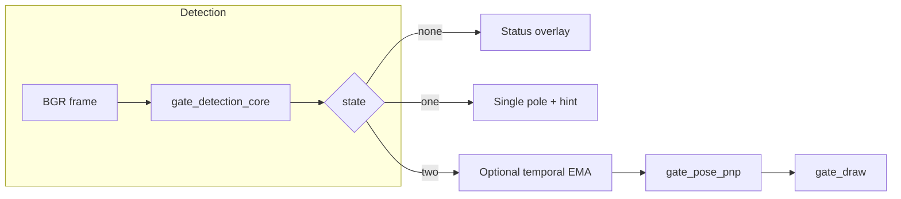

# SAUVC Gate Detection Pipeline

Classical computer vision pipeline for **navigation** and **qualification** gates in the **Singapore Autonomous Underwater Vehicle Challenge (SAUVC)**. It runs on **OpenCV + NumPy** and targets embedded use (e.g. **Jetson Orin Nano**).

**What you get from each frame**

| Output | Meaning |
|--------|--------|
| **Gate state** | `none` — no reliable pole; `one` — single vertical structure (no fake “second pole”); `two` — left/right poles for a gate |
| **Geometry (pixels)** | Pole x-positions, apparent width (px), image-center error, skew metric |
| **Optional pose** | Plane normal in the camera frame, **yaw error** hint (degrees), mean reprojection error (px) — when PnP succeeds and reprojection is good enough for display |

The rulebook PDF in this repo (`The Singapore AUV Challenge 2026 Rulebook.pdf`) defines task geometry; pole spacing is modeled as **1.5 m** between verticals unless you override it.

---

## Table of contents

1. [Quick start](#quick-start)
2. [Repository layout](#repository-layout)
3. [How processing works (high level)](#how-processing-works-high-level)
4. [Detection states (`none` / `one` / `two`)](#detection-states-none--one--two)
5. [Image processing stages](#image-processing-stages)
6. [Pose: PnP, FOV, and yaw](#pose-pnp-fov-and-yaw)
7. [Temporal smoothing (video / live)](#temporal-smoothing-video--live)
8. [Command-line tools](#command-line-tools)
9. [Configuration (`PipelineConfig`)](#configuration-pipelineconfig)
10. [Overlays and evaluation](#overlays-and-evaluation)
11. [Datasets and `.gitignore`](#datasets-and-gitignore)
12. [Tuning and troubleshooting](#tuning-and-troubleshooting)
13. [Integration on the vehicle](#integration-on-the-vehicle)
14. [Dependencies](#dependencies)
15. [Authors](#authors)

---

## Quick start

**1. Environment (Python 3)**

```bash
cd /path/to/Gate-Detection
python3 -m venv .venv
source .venv/bin/activate
pip install -r requirements.txt
```

**2. Put images in a folder** of `.png` files (see [Datasets](#datasets-and-gitignore)). Defaults assume folders under `images/`.

**3. Run a batch viewer**

```bash
# Navigation-style (structure only, no HSV boost)
python3 navigation_gate_detector.py --folder images/image_navigation_01

# Qualification-style (optional red/orange HSV boost)
python3 qualification_gate_detector.py --folder images/image_qualification_01
```

**4. Live camera**

```bash
python3 live_gate_detector.py --device 0 --fov 65 --temporal 0.4
# Qualification-style color boost:
python3 live_gate_detector.py --qualification --fov 65
```

**5. Metrics only (no GUI)**

```bash
python3 evaluate_gates.py --folder images/image_navigation_01
python3 evaluate_gates.py --folder images/image_qualification_01 --qualification
```

Press **Esc** in OpenCV windows to stop batch scripts; **q** or **Esc** in live mode.

---

## Repository layout

| File | Role |
|------|------|
| `gate_detection_core.py` | Vertical-structure pipeline, column histogram, **`detect_gate_with_state()`** → `none` / `one` / `two`, ROI, filtered edges for PnP |
| `gate_pose_pnp.py` | Approximate **K** from horizontal FOV, **4 image corners** (line fits + fallbacks), **`solvePnP` / refine**, normal, **yaw**, reprojection error |
| `gate_pipeline.py` | **`PipelineConfig`**, **`process_frame()`** — detection → optional temporal → PnP → overlays; PnP draw gated by reproj ≤ **25 px** |
| `gate_draw.py` | Poles, center line, metrics text, PnP arrow / corners, one-pole UI |
| `gate_temporal.py` | **EMA** on left/right pole **x** for sequences |
| `navigation_gate_detector.py` | Batch over `--folder`; navigation preset (`use_color_boost=False`) |
| `qualification_gate_detector.py` | Batch; qualification preset (`use_color_boost=True`) |
| `live_gate_detector.py` | Webcam / V4L2 loop, FPS overlay |
| `evaluate_gates.py` | Batch stats: state counts, PnP reproj, \|yaw\| when reproj ≤ 25 px |
| `requirements.txt` | Pinned OpenCV / NumPy |
| `.gitignore` | Local datasets and media excluded from git |

---

## How processing works (high level)



For **`two`**: optional **temporal** filter adjusts pole x-coordinates → **PnP** estimates pose using pole lines, horizontal edges, and a **1.5 m** wide rectangle (height from image aspect when not fixed) → **draw** shows geometry and, if PnP is OK and **reproj ≤ 25 px**, the normal arrow and corner dots.

---

## Detection states (`none` / `one` / `two`)

The pipeline **does not** invent a second pole when only one structure is visible.

| State | Behavior |
|-------|----------|
| **`none`** | No confident vertical gate structure; overlay shows **no gate**. |
| **`one`** | One dominant vertical peak; draws that pole and a small **“2nd pole…”** hint — **no** center line between two poles. |
| **`two`** | Two separated peaks pass geometry checks; full overlay — green poles, **yellow center line**, width and centering error, optional bars and PnP. |

This keeps downstream logic honest: use **`two`** for alignment and PnP; **`one`** can mean “approaching” or occlusion.

---

## Image processing stages

The core path (see `gate_detection_core.py`) is designed for **murky, low-contrast** pool imagery.

1. **Optional HSV boost** (qualification): red/orange masks weighted into gradients — helps when poles are colored and visibility allows.
2. **Grayscale** and **CLAHE** for local contrast.
3. **Gaussian blur** to reduce speckle.
4. **Sobel-x** (vertical edges) and **Canny** edge map.
5. **Morphology** (vertical closing) to connect broken edges.
6. **Vertical run filter** — drop short segments; poles are tall.
7. **Column strength** — sum edge response per column; find peaks with spacing constraints.
8. **Sub-pixel** peak refinement and **skew** metric between pole regions.

Outputs include **`left_x` / `right_x`**, **distance in pixels**, **center** vs image middle, and a **binary `filtered_edges`** ROI for PnP line fitting.

---

## Pose: PnP, FOV, and yaw

**Camera matrix `K`**

- Default: **`camera_matrix_from_fov(width, height, horizontal_fov_deg)`** — pinhole model from **horizontal FOV** only (`--fov`).
- For real deployments, **replace with calibrated `K` and distortion `D`** (underwater calibration strongly recommended). `estimate_gate_pose()` accepts `dist`; the pipeline currently passes zeros.

**Gate model**

- Rectangle in the gate plane: **width** = `--gate-width` (meters), default **1.5**.
- **Height** in 3D: if not fixed, **`infer_gate_height_m`** matches the **image quad aspect** (width in 3D fixed, height scales) — avoids assuming a square 1.5×1.5 m gate when the image aspect differs.

**Image corners**

- Prefer **intersections** of fitted **left/right pole lines** with **top/bottom horizontal** structure between poles; fallback to a bounding quad from the edge mask.
- Corners are ordered **BL, BR, TR, TL** before PnP.

**Solve**

- `solvePnPRansac` then **`solvePnPRefineLM`**; mean reprojection error over the four corners is stored as **`reproj_err_px`**.

**Normal and yaw**

- Plane normal in the camera frame comes from the solved pose.
- **Yaw error** uses the direction **into** the gate (**−normal**), with **`atan2(nx, nz)`** for a level camera (see `gate_pose_pnp.py`).

**Display gate**

- In `process_frame()`, the **PnP arrow, text, and magenta corner dots** are shown only if **`pose.ok`** and **`reproj_err_px ≤ 25`**. You still get raw pose in code paths that return it; the overlay is conservative.

---

## Temporal smoothing (video / live)

`GateTemporalFilter` applies an **EMA** to **left_x** and **right_x** when state is **`two`**:

`smoothed = alpha * smoothed_prev + (1 - alpha) * measurement`

- **`alpha` → 1**: smoother, slower to move (more weight on history).
- **`alpha` → 0**: follows measurements closely.

**Suggested values**: batch sequences `~0.35`; live default in `live_gate_detector.py` is **`0.4`**. Set `--temporal 0` to disable.

---

## Command-line tools

### `navigation_gate_detector.py`

| Argument | Default | Description |
|----------|---------|-------------|
| `--folder` | `images/image_navigation_01` | Directory of `.png` images (relative to repo or absolute). |
| `--delay` | `500` | Milliseconds between frames in GUI mode. |
| `--no-gui` | off | Process all images, no windows; prints summary only. |
| `--fov` | `60` | Horizontal field of view (degrees) for approximate `K`. |
| `--gate-width` | `1.5` | Pole spacing in meters for PnP. |
| `--no-pnp` | off | Disable pose estimation. |
| `--temporal` | `0` | EMA `alpha` for poles; `0` = off. |

Uses **`use_color_boost=False`**.

---

### `qualification_gate_detector.py`

Same flags as navigation; defaults to **`images/image_qualification_01`**.

Uses **`use_color_boost=True`** (HSV red/orange assist).

---

### `live_gate_detector.py`

| Argument | Default | Description |
|----------|---------|-------------|
| `--device` | `0` | OpenCV camera index. |
| `--width`, `--height` | `0` | Request resolution; `0` leaves driver default. |
| `--fov` | `60` | Horizontal FOV (deg). |
| `--gate-width` | `1.5` | Gate width (m). |
| `--no-pnp` | off | Disable PnP. |
| `--temporal` | `0.4` | EMA alpha (live default on). |
| `--qualification` | off | Enable same HSV boost as qualification batch script. |

Tries **V4L2** first, then default backend; sets **MJPG** where supported.

---

### `evaluate_gates.py`

| Argument | Required | Description |
|----------|----------|-------------|
| `--folder` | yes | Image directory. |
| `--qualification` | off | Use qualification detection (color boost). |
| `--fov` | `60` | Horizontal FOV for `K`. |
| `--gate-width` | `1.5` | Gate width (m). |

Prints counts for **`two` / `one` / `none`**, mean/median/max **reprojection error** for successful PnP on two-pole frames, count of frames with **reproj ≤ 25 px**, and mean **|yaw_err|** when reprojection is in that good set. Ends with short **tuning hints**.

---

## Configuration (`PipelineConfig`)

Defined in `gate_pipeline.py`:

| Field | Meaning |
|-------|--------|
| `use_color_boost` | `False` = navigation style; `True` = qualification (HSV assist). |
| `horizontal_fov_deg` | Used to build `K` via `camera_matrix_from_fov`. |
| `gate_width_m` | Physical width between pole centers (m). |
| `use_pnp` | If `False`, no `estimate_gate_pose` call. |
| `temporal_alpha` | If `> 0`, EMA on pole x before PnP/draw (requires a `GateTemporalFilter` instance in `process_frame`). |

---

## Overlays and evaluation

**Batch scripts** open **Gate Detection** (main) and **Edges** (small) when GUI is enabled.

**Two poles**

- Full-height **green** lines at pole x; **yellow** vertical center line; gray tick at image center.
- Text: width (px), lateral error, skew.
- Optional **orange** horizontal segments where **horizontal bars** are found between poles.
- If PnP passes the reproj threshold: second line of text (yaw, reproj, normal), **arrow** from gate center, **magenta** corner markers.

**One pole**

- Orange pole line; status **“2nd pole…”**.

**Live**

- FPS and **state** on the bottom of the frame.

---

## Datasets and `.gitignore`

Large data are **not** committed. `.gitignore` includes:

- `air_dataset/`
- `images/`
- `gopro_videos/`

Create `images/...` locally and add your own `image_navigation_*` / `image_qualification_*` folders of **`.png`** frames. Only `.png` files are enumerated by the batch scripts and `evaluate_gates.py`.

---

## Tuning and troubleshooting

1. **Wrong FOV** → bad `K` → bad PnP and yaw even if poles look fine. Match `--fov` to the lens, or use a calibrated `K` (code change in `gate_pipeline.py` / `gate_pose_pnp.py`).
2. **Underwater distortion** → calibrate **intrinsics + distortion** and pass `dist` into `estimate_gate_pose`.
3. **High `one` or `none` rate** → inspect **Edges** window; adjust separation / strength logic in `gate_detection_core.py` (e.g. `min_sep_frac` / `max_sep_frac` and related thresholds — see file for current parameters).
4. **PnP ok but reproj large** → corner construction failed partially; check lighting, motion blur, and occlusion.
5. **Jittery live overlay** → increase `--temporal` toward `0.5` (smoother); decrease toward `0` for snappier response.

---

## Integration on the vehicle

Typical integration steps (not implemented in this repo):

1. Run **`process_frame()`** on each frame from your camera node (or wrap `live_gate_detector.py` logic).
2. Subscribe to **`state == "two"`** for control and PnP; treat **`one`** as degraded.
3. Replace **FOV-based `K`** with your calibration file for the underwater housing.
4. Forward **center error (px)** or **yaw_error_deg** to your controller; fuse with **IMU** / depth as needed.
5. For **ROS 2**, expose a node with image subscription and debug image publication.

---

## Dependencies

From `requirements.txt`:

- `opencv-python==4.8.1.78`
- `numpy==1.24.4`

Install:

```bash
pip install -r requirements.txt
```

---

## Authors

Developed as part of the **Team Aritra AUV Project** for the **Singapore Autonomous Underwater Vehicle Challenge (SAUVC)**.
